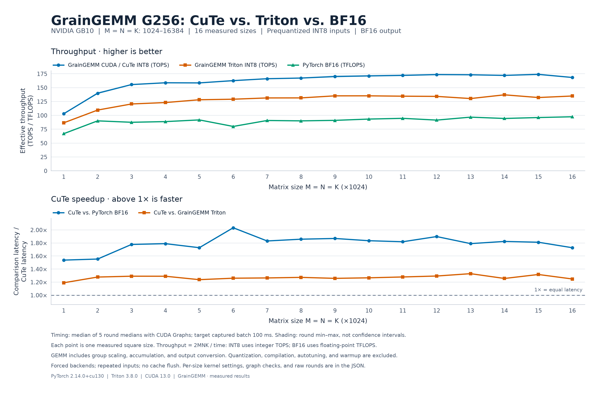

# Tests and benchmarks

**Hardware scope: this published batch is GB10-only (SM121, compute capability
12.1).** All measured performance, tuned configurations and backend rankings,
especially the CuTe/CUTLASS comparisons, apply only to NVIDIA GB10. Thor / Jetson
T5000 uses SM110 (compute capability 11.0) and requires an independent
implementation, tuning and validation. See [NVIDIA's compute capability
table](https://developer.nvidia.com/cuda/gpus). This experiment boundary does not
limit GrainGEMM's goal of supporting multiple GPU architectures.

Validation, measurements, and reproduction instructions for GrainGEMM and the standalone SGLang Triton baseline. See the [project README](../README.md) for the operation, API, and research basis.

For the separate CUTLASS collective backend, see
[CUTLASS build, correctness checks, and comparison instructions](cutlass.md).

## Published GB10 experiments

The reports below retain explicit M/N/K, latency and throughput for every
shape, with raw measurements and source provenance. INT8 throughput is TOPS;
historical equivalent-TFLOPS columns use the same `2MNK/time` convention.
All measure prequantized GEMM, including group scaling and output conversion;
they exclude input quantization and do not measure end-to-end model inference.

| Experiment | Scope | Results |
|---|---|---|
| LLM prefill | 51 shapes covering 54 projection uses, including routed experts and both vocabulary sizes | [Report and raw data](results/llm-prefill/README.md) |
| M=256 dispatch diagnosis | 14 cases, tile choices and CTA-capacity boundary sweeps | [Diagnosis and measurements](results/m256-dispatch/README.md) |
| Initial CUTLASS comparison | Three M=256 projections and 16 square sizes, original eight CUTLASS configurations | [Per-shape table](results/cutlass/initial/README.md) |
| Model projections | M=1024/2048, 18 shapes, CuTe/CUTLASS/Triton | [Original comparison](results/cutlass/model-projections/README.md) |
| CUTLASS optimization | The same 18 projection shapes, eight versus 32 CUTLASS configurations, with freshly measured CuTe/Triton | [Optimization and ablations](results/cutlass/optimized/README.md) |
| Remaining CuTe/CUTLASS gap | Three paired runs and four M=4096 cases, fixed configurations | [Root-cause experiments](results/cutlass/residual-gap/README.md) · [M=4096 latency and TOPS](results/cutlass/residual-gap/paired_m4096/report.md) |

Each report documents its own candidate set and measurement protocol. Do not
combine latencies from separate runs into a speedup. Historical forced-backend
defaults may differ from current dispatch; the three measured M=256 choices
are now integrated into `auto`. K-lower-bound and tail-synchronization
ablations remain [isolated experiments](../experiments/cutlass/README.md).

The CuTe/CUTLASS GPU experiment entry points verify both a device name containing
`GB10` and compute capability `(12, 1)`, and reject other devices. CPU-only report
rendering and source/data audits do not require a GPU. Historical raw reports
remain unchanged; their results do not become measurements for another GPU by
rebuilding the source for that GPU.
The native and experimental build entry points accept only `--arch sm_121`;
other targets are rejected. Cross-compilation itself does not require a GPU.

Run all commands below from the **repository root**, using a CUDA-enabled PyTorch build and a compatible Triton version. Install the test and plotting dependencies with:

```bash
python -m pip install -e ".[runtime,test,plot]"
```

## Correctness checks

The [GrainGEMM tests](../tests/test_int8_gemm.py) and [baseline tests](../tests/test_sglang_baseline.py) compare the kernels against independent CPU INT32 dot products and covers group sizes, distinct row/column/group scales, tails, transposed views, output dtypes, empty dimensions, and invalid inputs.

```bash
python -m pytest -q
```

## GB10 custom-kernel comparison

The optimized **C++/CuTe backend wins all 16 square sizes** against both the
current tuned GrainGEMM Triton backend and PyTorch BF16 in this run. For
**M = N = K = 1024, 2048, …, 16384, G256**, per-size speedups are
**1.19–1.33× over Triton** and **1.54–2.03× over BF16**.
Peak measured CuTe throughput is **173.98 TOPS**.
These ranges describe individual sizes; no results are averaged across shapes.



| M = N = K | CuTe INT8 TOPS | Triton INT8 TOPS | BF16 TFLOPS | CuTe / Triton | CuTe / BF16 |
|---:|---:|---:|---:|---:|---:|
| 1024 | 102.89 | 86.49 | 66.94 | 1.190× | 1.537× |
| 2048 | 139.91 | 109.54 | 90.09 | 1.277× | 1.553× |
| 3072 | 155.53 | 120.54 | 87.52 | 1.290× | 1.777× |
| 4096 | 158.75 | 123.10 | 88.74 | 1.290× | 1.789× |
| 5120 | 158.53 | 128.13 | 91.78 | 1.237× | 1.727× |
| 6144 | 162.65 | 129.12 | 80.01 | 1.260× | 2.033× |
| 7168 | 166.08 | 131.42 | 90.74 | 1.264× | 1.830× |
| 8192 | 167.29 | 131.49 | 90.06 | 1.272× | 1.858× |
| 9216 | 169.99 | 135.19 | 90.97 | 1.257× | 1.869× |
| 10240 | 171.13 | 135.22 | 93.30 | 1.266× | 1.834× |
| 11264 | 172.07 | 134.56 | 94.63 | 1.279× | 1.818× |
| 12288 | 173.54 | 134.21 | 91.44 | 1.293× | 1.898× |
| 13312 | 173.20 | 130.31 | 96.78 | 1.329× | 1.790× |
| 14336 | 172.08 | 137.05 | 94.39 | 1.256× | 1.823× |
| 15360 | 173.98 | 132.16 | 96.08 | 1.316× | 1.811× |
| 16384 | 168.32 | 134.89 | 97.47 | 1.248× | 1.727× |

The comparison **forces each backend**: CuTe never falls back to Triton. Both
INT8 paths use identical prequantized inputs and FP32 scales; BF16 uses the
corresponding original BF16 tensors. A is row-major, B is column-major, and all
outputs are BF16. **Input quantization is excluded**. INT8 dot products, group
scaling, FP32 accumulation and output conversion are included. Compilation,
warmup, tuning and host dispatch are outside the timer; inputs are not packed.

An offline search measures **17 CuTe and four Triton configurations**, each in
three rounds with 20 ms captured batches. The best configuration for each backend
and each size is stored separately. A **fresh five-round comparison** then uses
100 ms captured batches, 50 untimed warmup calls per implementation, and rotating
implementation order. The median of round medians is reported separately for
each shape; the installed Triton helper replays each captured batch ten times.
Shading shows the min–max of round medians, not confidence intervals. The results
establish performance for these candidate sets, not a global limit of either
programming system.

Timing uses repeated inputs without a cache flush; clocks and power settings
are not overridden. These are **GB10 GPU GEMM measurements**, excluding activation
quantization and end-to-end inference overhead. They do not establish speedups
on A100, H100 or Thor. Throughput is `2MNK / time`: integer **TOPS** for INT8 and
floating-point **TFLOPS** for BF16 on the same operation-count scale.

Both INT8 backends pass independent sampled CPU INT32 group-dot checks before
timing. Each size also checks CUDA Graph replay after zeroing and restoring the
activation. Full outputs are checked for finite values. Synthetic quantization
error relative to BF16 is recorded separately; it does not establish model
accuracy.

- [Per-size CSV](results/gb10_cute_g256_square_sweep.csv): latencies, throughputs,
  ratios, configurations and every timing round.
- [Full comparison JSON](results/gb10_cute_g256_square_sweep.json): software,
  source/build hashes, raw rounds, correctness, replay and quantization checks.
- [Offline tuning JSON](results/gb10_cute_g256_tuning.json): all 21 candidates
  at each of the 16 sizes, including raw rounds and correctness checks.
- [Kernel design and native build](../docs/kernel_design.md): scale pipelines,
  output stores, shared-memory limits and dispatch behavior.

Reproduce after building the optional native backend:

```bash
python benchmarks/compare_backends.py --output benchmarks/results/gb10_cute_g256_square_sweep.json
python benchmarks/plot_backends.py --input benchmarks/results/gb10_cute_g256_square_sweep.json --output docs/assets/gb10_cute_g256_vs_triton_bf16.png --svg docs/assets/gb10_cute_g256_vs_triton_bf16.svg
```

Regenerate the per-size dispatch table on this GB10:

```bash
python benchmarks/tune_grain.py --output benchmarks/results/gb10_cute_g256_tuning.json --dispatch-output src/grain_gemm/kernels/configs/sm121_g256.json
```

Then rerun the separate comparison. Both measurement scripts accept
`--sizes 1024 2048 4096` for a subset; the plotting script requires all 16 sizes.
The forced comparison requires a native build and fails if it is unavailable.
The public `backend="auto"` API still uses Triton when native code is unavailable.
Rankings can change with the toolchain, thermal state and input shape.

### Kernel validation

**156 tests pass on GB10**, covering all 17 native configurations, minimum and
long K, signed/zero scales and INT8 extrema, partial CTA bands, unaligned-view
fallback, non-default streams, and CUDA Graph replay. A cancellation regression
checks an analytically exact `2^-36` result with zero tolerance for both backends;
ordinary CPU comparisons retain their existing tolerances.

Compute Sanitizer 2025.3.1 reports **0 memcheck errors** and **0 racecheck hazards**
for all 17 configurations at K256/K4352 and a Triton tail case. Reproduce with:

```bash
python -m pytest -q
compute-sanitizer --tool memcheck --error-exitcode 1 python tests/sanitize_kernels.py
compute-sanitizer --tool racecheck --error-exitcode 1 python tests/sanitize_kernels.py
```

### Earlier mixed-backend measurements

The previous mixed-backend sweep selected CuTe only at 4096 and Triton at the
other 15 sizes. Its unchanged artifacts remain available for historical context:
[chart](../docs/assets/gb10_grain_g256_vs_baselines.png),
[CSV](results/gb10_grain_g256_square_sweep.csv),
[comparison JSON](results/gb10_grain_g256_square_sweep.json), and
[tuning JSON](results/gb10_g256_tuning.json). The raw comparison also retains its
SGLang baseline; the chart shows only GrainGEMM and BF16. Those measurements
predate the current CuTe kernels and dispatch table.

## SGLang Triton baseline

[`sglang_int8_gemm`](../src/grain_gemm/baselines/sglang.py) extracts SGLang's INT8 kernel at [commit `8ac19cc`](https://github.com/sgl-project/sglang/blob/8ac19cc19f8ade51ed203478f17c9a09c706d730/python/sglang/kernels/ops/quantization/int8_kernel.py). It runs independently of the SGLang package. The original kernel computation is retained; GrainGEMM supplies the input validation and launch wrapper. See [third-party notices](../THIRD_PARTY_NOTICES.md) for attribution and the upstream Apache-2.0 license.

- Inputs: INT8 `A[M, K]` and `B[K, N]`, with FP32 scales `[M, ceil(K/G)]` and `[ceil(K/G), N]` on the same CUDA device.
- Groups: **32, 64, 128, 256**; the default is **256**. The final group may be shorter than G.
- Accumulation: one INT32 dot product per complete K-group (or masked tail), followed by FP32 scaling and accumulation. Output may be FP32 (default), FP16, or BF16.
- Layout: transposed positive-stride views are accepted without an implicit copy. For example, weights stored as `[N, K]` can be passed as `weight.T`.

The wrapper sets `group_n=1` and `BLOCK_SIZE_K=G`. Its M/N compute tiles are independent of the quantization groups, avoiding a one-column compute tile when weights have per-column scales. The default launch configuration is a starting baseline, not an autotuned SGLang result. `block_m`, `block_n`, `num_warps`, and `num_stages` can be overridden for experiments.

Use a CUDA-enabled PyTorch build and a compatible Triton version on Linux. Triton's CUDA driver build also needs a C compiler and matching Python development headers.

```bash
python -m pip install -e ".[baseline]"
```

Example using prequantized inputs and their dequantization scales:

```python
import torch
from grain_gemm.baselines import sglang_int8_gemm

M, N, K, G = 128, 1024, 4096, 256
a = torch.randint(-127, 128, (M, K), device="cuda", dtype=torch.int8)
b = torch.randint(-127, 128, (N, K), device="cuda", dtype=torch.int8).T
scale_a = torch.full((M, K // G), 1 / 127, device="cuda")
scale_b = torch.full((K // G, N), 1 / 127, device="cuda")
c = sglang_int8_gemm(a, b, scale_a, scale_b, group_size=G)
```

## Group-size benchmark

```bash
python benchmarks/bench_sglang.py --m 128 --n 4096 --k 4096 --group-size 32 64 128 256
```

The benchmark checks up to 32 evenly spaced output rows and columns against independent CPU INT32 dot products before timing. It reports median CUDA-graph GEMM latency with repeated inputs and no cache flush, excluding compilation, warmup, and input preparation. It does not measure activation quantization or end-to-end inference latency. The group-size sweep uses synthetic inputs and is not a model-accuracy evaluation. Use `--output results.json` to save the GPU, software versions, launch configuration, checks, and measurements.

Initial validation on **GB10**, with PyTorch 2.14.0+cu130 and Triton 3.8.0: **26 tests passed**. An [example benchmark report](results/gb10_m128_n4096_k4096_fp32.json) records all four group sizes at `M=128, N=4096, K=4096`. G64 was fastest in this single run with the default untuned configuration; this does not establish a general group-size ranking or performance on the target GPUs.

## Original SGLang baseline sweep

The following comparison measures **M = N = K from 1024 to 16384 in steps of 1024**, with **G256**. Each of the 16 sizes is measured independently in five rounds with alternating implementation order. The chart uses effective throughput, `2MNK / time`, calculated from each size's median latency. INT8 values are **TOPS** and BF16 values are **TFLOPS**, displayed on the same operation-count scale.


Both paths use the same original BF16 inputs, row-major A, column-major B, and BF16 output. The INT8 path quantizes its inputs before timing and uses the default untuned `32 × 64` output tile, 4 warps, and 2 stages. CUDA-graph timing uses repeated inputs without a cache flush and excludes quantization, compilation, warmup, and host dispatch overhead. These are GB10 kernel measurements, not end-to-end inference results or measurements on A100/H100/Thor.

The [CSV](results/gb10_g256_square_sweep.csv) contains per-size throughput, latency, and ratios. The [JSON](results/gb10_g256_square_sweep.json) retains every timing round, software versions, sampled correctness checks, and synthetic-input quantization error. No values are averaged across different matrix sizes.

Reproduce the sweep and figure:

```bash
python -m pip install -e ".[baseline,plot]"
python benchmarks/sweep_bf16.py --start 1024 --stop 16384 --step 1024 --group-size 256 --output benchmarks/results/gb10_g256_square_sweep.json
python benchmarks/plot_bf16_sweep.py --input benchmarks/results/gb10_g256_square_sweep.json --output docs/assets/gb10_g256_vs_bf16.png
```
