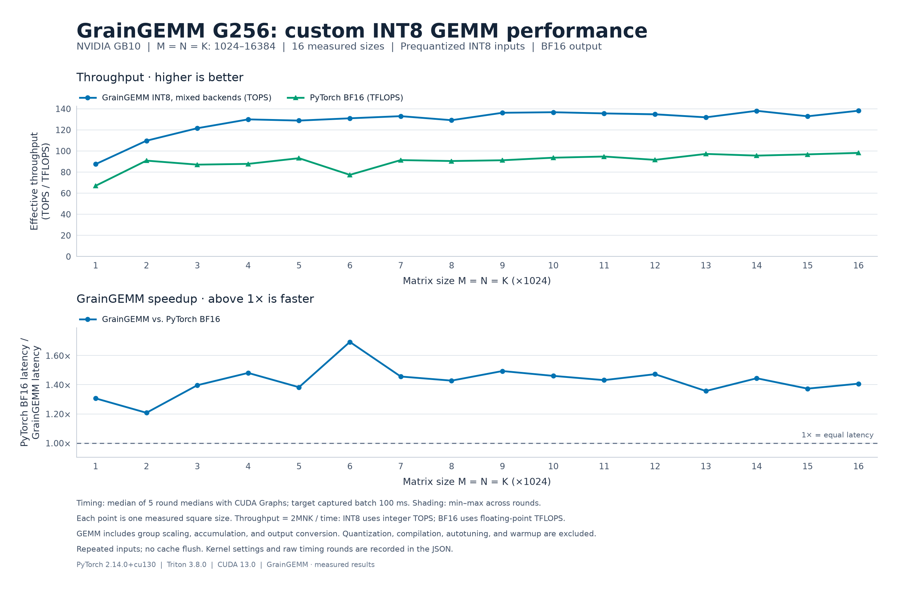
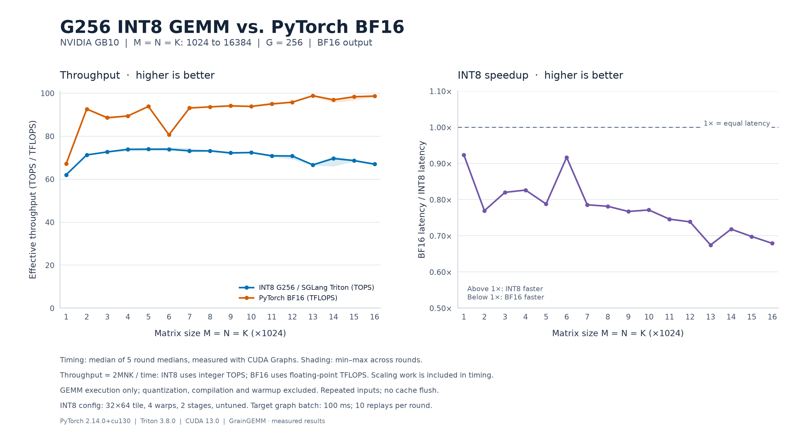

# Tests and benchmarks

Validation, measurements, and reproduction instructions for GrainGEMM and the standalone SGLang Triton baseline. See the [project README](../README.md) for the operation, API, and research basis.

Run all commands below from the **repository root**, using a CUDA-enabled PyTorch build and a compatible Triton version. Install the test and plotting dependencies with:

```bash
python -m pip install -e ".[runtime,test,plot]"
```

## Correctness checks

The [GrainGEMM tests](../tests/test_int8_gemm.py) and [baseline tests](../tests/test_sglang_baseline.py) compare the kernels against independent CPU INT32 dot products and covers group sizes, distinct row/column/group scales, tails, transposed views, output dtypes, empty dimensions, and invalid inputs.

```bash
python -m pytest -q
```

## GB10 custom-kernel comparison

The custom implementation has **118 passing tests on GB10**, including all eight
native CUDA configurations, G256 minimum/long-K cases, unaligned-view fallback,
CUDA Graph replay with changed inputs, and non-default-stream ordering.

Compute Sanitizer 2025.3.1 also reported **0 memcheck errors** and **0 racecheck
hazards** for all eight native configurations at K256/K4352 plus a Triton tail
case. These focused checks are available in
[`tests/sanitize_kernels.py`](../tests/sanitize_kernels.py):

```bash
compute-sanitizer --tool memcheck --error-exitcode 1 python tests/sanitize_kernels.py
compute-sanitizer --tool racecheck --error-exitcode 1 python tests/sanitize_kernels.py
```

The following sweep measures **M = N = K from 1024 to 16384, step 1024, G256**.
**All 16 sizes are faster than BF16 in this run**, with per-size speedups from 1.21× to 1.69×.
Each size is reported separately. The chart compares GrainGEMM with PyTorch BF16
across all 16 sizes. The raw CSV and JSON also retain the unchanged SGLang default
baseline, measured in the same experiment.



GrainGEMM uses the checked-in per-size dispatch table: the fastest of **four
Triton and eight CUDA/CuTe candidates** in an offline search of three rounds per
candidate. The selected configuration is then evaluated in a **separate five-round
comparison**, rotating implementation order. Native CuTe is selected at 4096;
the measured Triton configurations are selected for the other 15 square sizes.
The best Triton fallback is also stored for systems without the native build.
This is the best measured candidate set, not proof of a global performance limit.

All three paths use the same original BF16 random inputs, row-major A,
column-major B, and BF16 output. Both INT8 paths use the same prequantized tensors
and FP32 scales. **Input quantization is excluded**; INT8 dot products, group
scaling, cross-group FP32 accumulation and BF16 output are included. Compilation,
warmup, tuning, and host dispatch are outside the timer. There is no hidden input
packing. Both INT8 implementations pass independent sampled CPU INT32 group-dot
checks before timing. Synthetic quantization differences are recorded separately
and do not establish model accuracy.

Timing uses `triton.testing.do_bench_cudagraph`, 100 ms captured batches and five
rounds, reporting the median of round medians. The installed Triton helper replays
each captured batch ten times. Inputs are reused without a cache flush; clocks
and power settings are not overridden. These are steady-state GPU GEMM results
on **GB10**, not end-to-end inference or A100/H100/Thor measurements. Throughput
is `2MNK/time`: **TOPS for INT8, TFLOPS for BF16**, on the same operation-count scale.

- [Per-size CSV](results/gb10_grain_g256_square_sweep.csv): all three latencies,
  throughputs, per-round timings, ratios and selected configurations.
- [Full comparison JSON](results/gb10_grain_g256_square_sweep.json): software,
  source hashes, every timing round, correctness and quantization differences.
- [Offline tuning JSON](results/gb10_g256_tuning.json): every candidate at every
  size, including its timing rounds and independent correctness check.

Reproduce after following the [optional native build instructions](../docs/kernel_design.md#build-the-optional-gb10-cuda-backend):

```bash
python benchmarks/compare_grain.py --output benchmarks/results/gb10_grain_g256_square_sweep.json
python benchmarks/plot_grain.py --input benchmarks/results/gb10_grain_g256_square_sweep.json --output docs/assets/gb10_grain_g256_vs_baselines.png --svg docs/assets/gb10_grain_g256_vs_baselines.svg
```

To rerun the search for this GB10 and regenerate its dispatch table:

```bash
python benchmarks/tune_grain.py --output benchmarks/results/gb10_g256_tuning.json --dispatch-output src/grain_gemm/kernels/configs/sm121_g256.json
```

Then rerun the separate comparison. Timing rankings can change with toolchain,
clocks, thermal state and input shape. `--sizes 1024 2048 4096` selects a subset in
either script. Without the optional native build, the search and comparison use
Triton; such a run must not be labeled as a measurement of the CuTe backend.

## Group-size benchmark

```bash
python benchmarks/bench_sglang.py --m 128 --n 4096 --k 4096 --group-size 32 64 128 256
```

The benchmark checks up to 32 evenly spaced output rows and columns against independent CPU INT32 dot products before timing. It reports median CUDA-graph GEMM latency with repeated inputs and no cache flush, excluding compilation, warmup, and input preparation. It does not measure activation quantization or end-to-end inference latency. The group-size sweep uses synthetic inputs and is not a model-accuracy evaluation. Use `--output results.json` to save the GPU, software versions, launch configuration, checks, and measurements.

Initial validation on **GB10**, with PyTorch 2.14.0+cu130 and Triton 3.8.0: **26 tests passed**. An [example benchmark report](results/gb10_m128_n4096_k4096_fp32.json) records all four group sizes at `M=128, N=4096, K=4096`. G64 was fastest in this single run with the default untuned configuration; this does not establish a general group-size ranking or performance on the target GPUs.

## Original SGLang baseline sweep

The following comparison measures **M = N = K from 1024 to 16384 in steps of 1024**, with **G256**. Each of the 16 sizes is measured independently in five rounds with alternating implementation order. The chart uses effective throughput, `2MNK / time`, calculated from each size's median latency. INT8 values are **TOPS** and BF16 values are **TFLOPS**, displayed on the same operation-count scale.



Both paths use the same original BF16 inputs, row-major A, column-major B, and BF16 output. The INT8 path quantizes its inputs before timing and uses the default untuned `32 × 64` output tile, 4 warps, and 2 stages. CUDA-graph timing uses repeated inputs without a cache flush and excludes quantization, compilation, warmup, and host dispatch overhead. These are GB10 kernel measurements, not end-to-end inference results or measurements on A100/H100/Thor.

The [CSV](results/gb10_g256_square_sweep.csv) contains per-size throughput, latency, and ratios. The [JSON](results/gb10_g256_square_sweep.json) retains every timing round, software versions, sampled correctness checks, and synthetic-input quantization error. No values are averaged across different matrix sizes.

Reproduce the sweep and figure:

```bash
python -m pip install -e ".[baseline,plot]"
python benchmarks/sweep_bf16.py --start 1024 --stop 16384 --step 1024 --group-size 256 --output benchmarks/results/gb10_g256_square_sweep.json
python benchmarks/plot_bf16_sweep.py --input benchmarks/results/gb10_g256_square_sweep.json --output docs/assets/gb10_g256_vs_bf16.png
```
